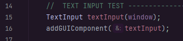
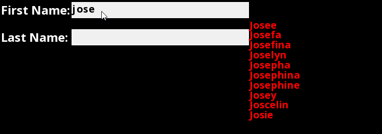
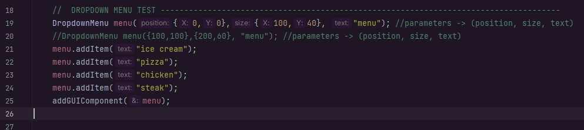
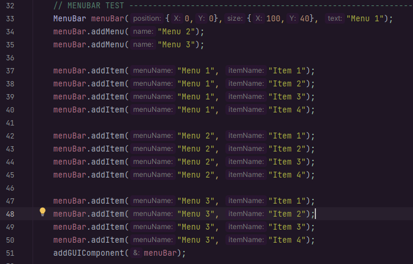
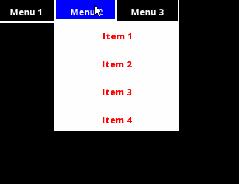

# SFML Text Button Utility Project
## By: <ins> Jose Gonzalez </ins>
The project has many different classes that utilize various different features for text input. It is a work in progress, 
however many different features have been implemented. The project is meant to be used as a utility for other projects. 
So far the project has an autocorrect feature, dropdown menu feature, text input feature, and the ability to undo text input.

- Currently working on the FileTree class. This class will allow for the user to navigate through a file system.

## Installation

- Instructions to install SFML on your computer can be found [here](https://www.sfml-dev.org/tutorials/2.5/start-linux.php).
- Clone the repository by https://github.com/josegonz115/Text-Button-Utility-Project.git

## Usage
- For all the features in the utility project. Certain codes in application.cpp have been commented off, simply
uncomment them to use the features.
- To use the text input and autocorrect feature.  

- To use the dropdown menu feature.  

- To use the menu bar feature.  

## Features

 

- Implemented:
  - A text input box.
  - Autocorrect of text input
  - Dropdown menu
  - Menu bar
  - Various SFML shortcuts for mouse events and keyboard events
  - a GUIComponent polymorphic class that allows for the user to create their own components

   

- Partly implemented:
  - a FileTree class that allows for the user to navigate through a file system.
  - undo feature has to be further implemented for other classes besides text input

